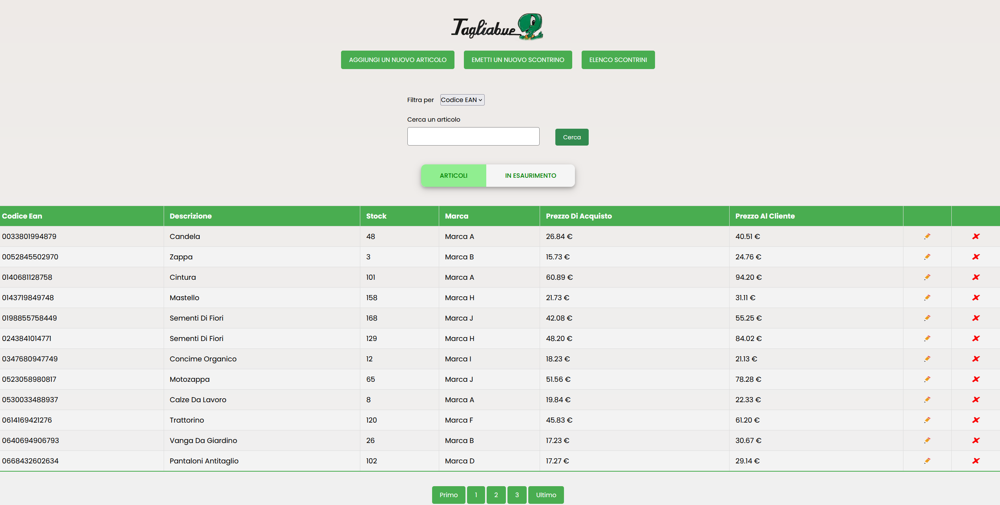
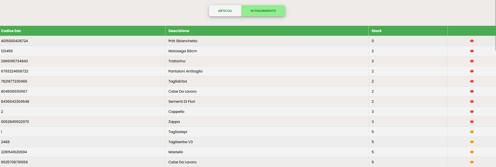
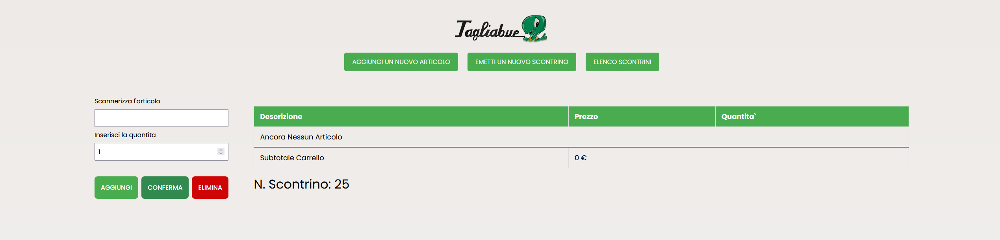
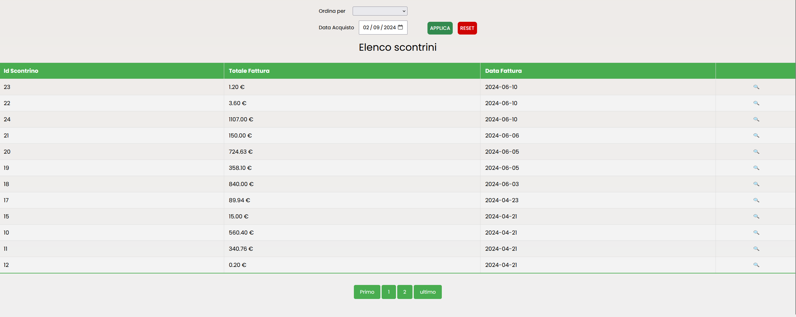

# WebApplication for Tagliabue 

first fullstack project developed with HTML,CSS,js and PHP vanilla.

This project was created for my high school final exam and help user to store Items informations like ean code, quantity of product, price etc. and to create a table in wich visualize every receipt order by date or other parameters.

Thanks to my contributor [@DaniNewAcc](https://github.com/DaniNewAcc) for the FrontEnd Side of this Project.

here some preview of the actual project:

