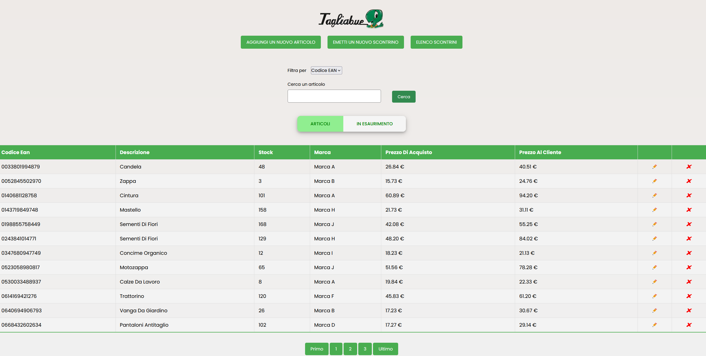
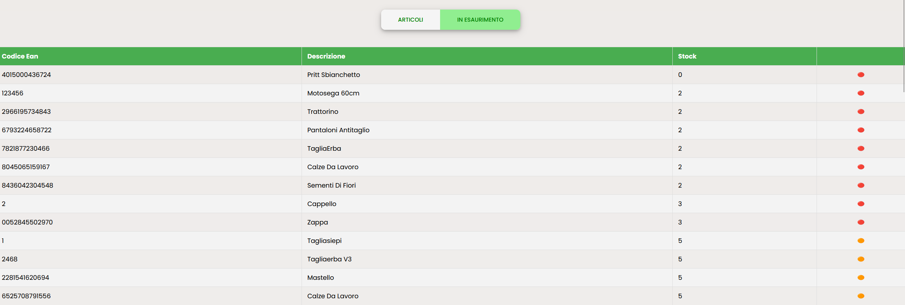
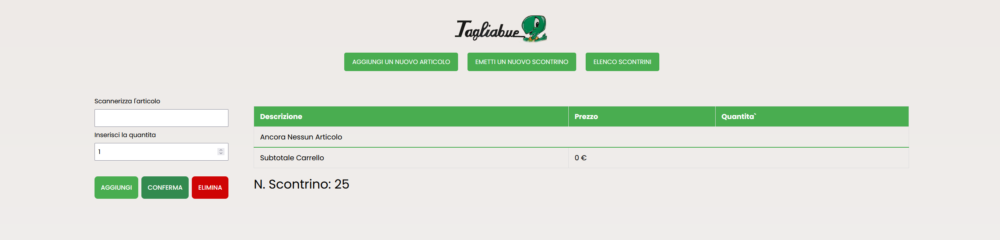
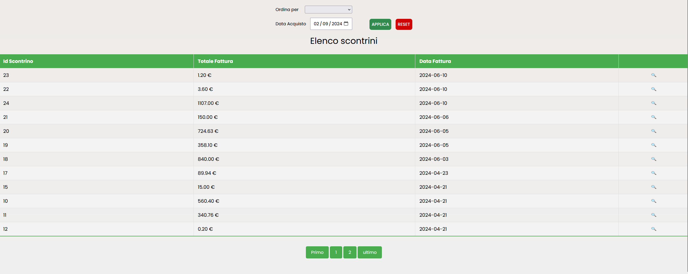

# WebApplication for Tagliabue 

first fullstack project developed with HTML,CSS,JavaScript, MySQL and PHP vanilla

This project was created for my high school final exam. It is an ERP software that helps user to store Item's informations like ean code, quantity of product, price and more. 

The system enables order issuance while decrementing sold quantities accordingly, and generates receipts which are accessible in a separate database table. 

Thanks to my contributor [@DaniNewAcc](https://github.com/DaniNewAcc) for the FrontEnd Side of this Project.

here some preview of the actual project:

